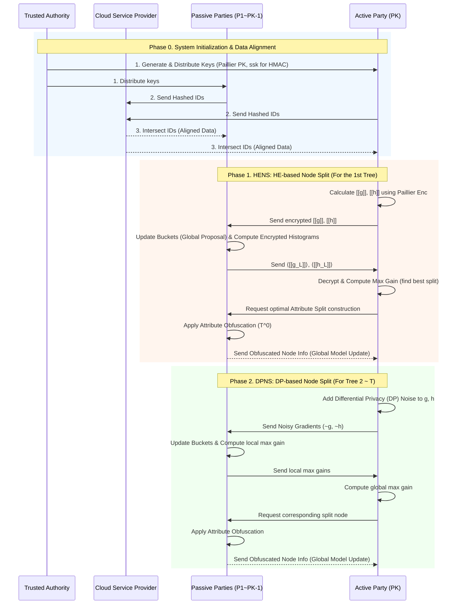
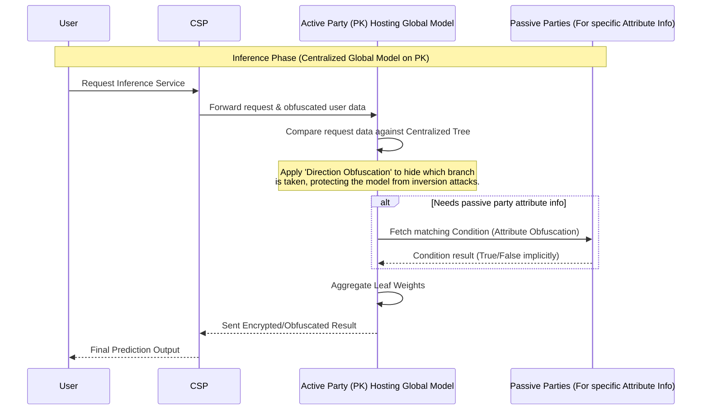

# ELXGB Architecture Diagram

논문 "ELXGB: An Efficient and Privacy-Preserving XGBoost for Vertical Federated Learning" 에 기반한 학습 및 추론 구조도입니다.

## 1. System Entities (시스템 개체)
- **TA (Trusted Authority)**: 키 생성 및 분배 관리자 (System Initialization)
- **CSP (Cloud Service Provider)**: 암호화된 상태의 Data Alignment(PSI) 및 추론(Inference) 라우팅 보조.
- **Active Party (PK)**: 데이터 레이블(Label $y$)을 소유하고 글로벌 중앙 집중형 트리를 구축 및 호스팅하는 주관사.
- **Passive Parties ($P_k$)**: 고유의 피처(Feature $X$)를 가지며, 히스토그램 연산을 수행하고 속성을 난독화하는 참여기관들.

## 2. Model Training Architecture (모델 학습)

## 3. Secure Inference Architecture (안전한 추론)

